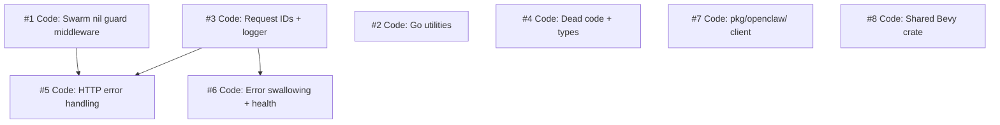

# Project Plan: Tech Debt Audit — Consolidate Duplicated Patterns, Improve Observability (v1)

## Scope

CRE-5 is a comprehensive tech debt audit covering the harness server and templates. The research phase identified 16 duplication categories, 10 convention inconsistencies, 18 observability gaps, and 8 maintainability issues with 18 prioritized recommendations. This project plan decomposes those recommendations into 8 right-sized child tickets organized in 4 execution waves, targeting the high and medium priority items. Lower-priority structural changes (Manager monolith split, Temporal abstraction, comprehensive test coverage) are deferred to future tickets.

## Ticket Decomposition

| # | Type | Title | Dependencies | Notes |
|---|------|-------|--------------|-------|
| 1 | code | Extract swarm nil guard to Echo middleware | none | 18 duplicate guards → 1 middleware |
| 2 | code | Extract Go utility functions (shortID, mimeToExt, safePath) | none | 3 utility extractions, consolidate scattered implementations |
| 3 | code | Add request IDs + enrich request logger | none | Echo middleware for X-Request-Id, enable method/latency/IP/size |
| 4 | code | Remove dead code + add typed constants | none | Delete unused funcs, add CheckpointStatus + TemplateType types |
| 5 | code | Standardize HTTP error handling | 1, 3 | Fix err.Error() leaks, bare fmt.Errorf in auth/swarm handlers |
| 6 | code | Fix error swallowing + enrich health endpoint | 3 | Log discarded errors, health checks DB/disk/tmux/game servers |
| 7 | code | Extract pkg/openclaw/ client + consolidate patterns | none | Mayor/president CLI duplication → shared client |
| 8 | code | Extract shared Bevy crate for 2D/boardgame templates | none | templates/shared/ with bridge, debug, camera modules |

## Dependency Graph

## Execution Order

### Wave 1 (parallel — no inter-dependencies)
- Ticket #1: Extract swarm nil guard to Echo middleware
- Ticket #2: Extract Go utility functions (shortID, mimeToExt, safePath)
- Ticket #3: Add request IDs + enrich request logger
- Ticket #4: Remove dead code + add typed constants

### Wave 2 (parallel — after #1 and #3)
- Ticket #5: Standardize HTTP error handling
- Ticket #6: Fix error swallowing + enrich health endpoint

### Wave 3 (parallel — independent, can start any time but sequenced here for review load)
- Ticket #7: Extract pkg/openclaw/ client + consolidate patterns
- Ticket #8: Extract shared Bevy crate for 2D/boardgame templates

## Detailed Ticket Descriptions

### Ticket #1: Extract swarm nil guard to Echo middleware

**Scope**: The `if s.SwarmManager == nil { return echo.NewHTTPError(503, ...) }` guard appears 18 times across swarm handlers. Extract to a single Echo middleware applied to the `/api/swarm/` and `/swarm/` route groups.

**Files to modify**:
- `harness/internal/server/server.go` — add middleware to swarm route groups
- `harness/internal/server/swarm_api.go` — remove 9 nil guards
- `harness/internal/server/swarm_dashboard.go` — remove 3 nil guards
- `harness/internal/server/swarm_hooks.go` — remove 6 nil guards

**Verification**: `just check` passes; confirm `/api/swarm/*` returns 503 when SwarmManager is nil.

### Ticket #2: Extract Go utility functions

**Scope**: Three utility extractions:
1. `shortID()` — replace 17+ `uuid.New().String()[:8]` calls with `pkg/id.Short()`
2. `mimeToExt` — consolidate 3 implementations (mayor.go, mayorchat/cover.go, imagegen.go) into one in `pkg/media/` or use existing `pkg/mayorchat.MimeToExt`
3. `safePath()` — extract path sanitization from server.go:657,674 and mayor_dashboard.go:135,177 into a shared utility

**Files to create**: `pkg/id/id.go` (or similar), possibly `pkg/media/mime.go`
**Files to modify**: 10+ files for shortID replacements, 3 files for mimeToExt, 2 files for safePath

**Verification**: `just check` passes; grep confirms no remaining `uuid.New().String()[:8]` patterns.

### Ticket #3: Add request IDs + enrich request logger

**Scope**:
1. Add Echo middleware to generate `X-Request-Id` header (UUID) and inject into request context/logger
2. Enrich existing request logger config (`server.go:111-122`) to include `LogMethod`, `LogLatency`, `LogRemoteIP`, `LogResponseSize`, `LogError`

**Files to modify**:
- `harness/internal/server/server.go` — middleware + logger config

**Verification**: `just check` passes; curl request shows X-Request-Id in response headers.

### Ticket #4: Remove dead code + add typed constants

**Scope**:
1. Delete: `mayor.Manager.DeleteAgent()` (openclaw.go:130-148), unused `BindAgentToDiscord()` (openclaw.go:75-127), `HeartbeatWorkflow` (workflows.go:53-119), duplicate `SpawnRequest` type (workflows.go — consolidate with `SessionParams`)
2. Add: `type CheckpointStatus string` constants in `internal/world/` or similar, `type TemplateType string` constants. Replace bare string literals at call sites.

**Files to modify**:
- `harness/internal/mayor/openclaw.go` — delete dead functions
- `harness/internal/swarmorch/workflows.go` — delete HeartbeatWorkflow, consolidate SpawnRequest/SessionParams
- New constants file(s) for typed statuses
- Call sites using string literals for checkpoint status and template type

**Verification**: `just check` passes; grep confirms no remaining bare `"building"`, `"ready"`, `"failed"` checkpoint strings or `"3d"`, `"2d"`, `"boardgame"` template strings outside constants.

### Ticket #5: Standardize HTTP error handling

**Scope**: Audit all HTTP handlers for error information leakage:
1. Replace `echo.NewHTTPError(..., err.Error())` with user-safe messages + `logger.Error(...)` (swarm_api.go:54,130 and others)
2. Replace bare `fmt.Errorf` returns in auth handlers (auth.go:63,138,283,311,455) with proper `echo.NewHTTPError`
3. Standardize async operation responses to use `202 Accepted` (fix swarm start handler)

**Depends on**: #1 (cleaner swarm handlers), #3 (request ID available for error logging)

**Files to modify**:
- `harness/internal/server/swarm_api.go`
- `harness/internal/auth/` handlers
- Other handlers identified during implementation

**Verification**: `just check` passes; grep for `err.Error()` in HTTP handler responses shows zero results.

### Ticket #6: Fix error swallowing + enrich health endpoint

**Scope**:
1. Replace `_ = operation()` and `_, _ :=` patterns with logged errors. Key locations: builder.go (PostBuild updates, JSONL writes), claude.go (checkpoint updates), manager.go (learning captures, JSONL writes), auth/middleware.go (UpdateLastSeen), swarm_hooks.go (JSON decode), mayor_dashboard.go (DB queries)
2. Enrich `/health` endpoint to check: DB ping, disk space, tmux availability, active game server count. Compose with existing swarm health data.

**Depends on**: #3 (request context logging available)

**Files to modify**:
- `harness/internal/builder/builder.go`
- `harness/internal/claude/claude.go`
- `harness/internal/swarmorch/manager.go`
- `harness/internal/auth/middleware.go`
- `harness/internal/server/swarm_hooks.go`
- `harness/internal/server/mayor_dashboard.go`
- `harness/internal/server/server.go` (health endpoint)

**Verification**: `just check` passes; grep for `_ =` and `_, _ :=` on error-returning calls shows reduced count; `/health` returns meaningful status checks.

### Ticket #7: Extract pkg/openclaw/ client

**Scope**: Mayor and president duplicate OpenClaw CLI interactions (agent creation, Discord binding, workspace file writing, CLI timeout constant). Extract to `pkg/openclaw/` with a `Client` struct wrapping the CLI binary path, timeout, and common operations.

**Files to create**: `pkg/openclaw/client.go`
**Files to modify**:
- `harness/internal/mayor/openclaw.go` — import pkg/openclaw, remove duplicated code
- `harness/internal/president/president.go` — import pkg/openclaw, remove duplicated code
- Also consolidate: OPENCLAW_HOME resolution (done 3x in mayor_dashboard.go) → resolve once on Server struct
- Also consolidate: president tmux spawn pattern (3x) → extract `spawnPresidentSession` helper

**Verification**: `just check` passes; grep confirms no duplicate CLI invocation patterns between mayor and president.

### Ticket #8: Extract shared Bevy crate for 2D/boardgame templates

**Scope**: Create `templates/shared/` as a Rust library crate with shared modules extracted from the near-identical code in 2D and boardgame templates:
1. `bridge.rs` — ~98% identical, extract common bridge code
2. `debug.rs` — ~80% identical, extract common debug infrastructure with extension points for domain-specific queries
3. `camera.rs` — ~60% identical, extract common camera base with template-specific extensions

Each template imports the shared crate as a path dependency and extends/overrides as needed.

**Files to create**: `templates/shared/Cargo.toml`, `templates/shared/src/lib.rs`, `templates/shared/src/bridge.rs`, `templates/shared/src/debug.rs`, `templates/shared/src/camera.rs`
**Files to modify**:
- `templates/2d/Cargo.toml` — add shared dependency
- `templates/2d/src/bridge.rs`, `debug.rs`, `camera.rs` — import from shared, keep only overrides
- `templates/boardgame/Cargo.toml` — add shared dependency
- `templates/boardgame/src/bridge.rs`, `debug.rs`, `camera.rs` — import from shared, keep only overrides

**Verification**: `just check` passes (both templates compile); WASM builds succeed for both templates.

## Milestones

- [ ] M1: Core cleanup — Swarm middleware, utilities extracted, request IDs active, dead code removed (Tickets #1-#4)
- [ ] M2: Error handling hardened — No error leaks in HTTP responses, discarded errors logged, health endpoint meaningful (Tickets #5-#6)
- [ ] M3: Agent code consolidated — pkg/openclaw/ client used by mayor + president, shared Bevy crate used by 2D + boardgame (Tickets #7-#8)
- [ ] M4: Final verification — `just check` passes with all changes integrated

## Graphite Stack Plan

Branch stack order (bottom to top):
1. `swarm/CRE-5/swarm-nil-guard-middleware` (ticket #1)
2. `swarm/CRE-5/extract-go-utilities` (ticket #2, parallel with #1)
3. `swarm/CRE-5/request-ids-logger` (ticket #3, parallel with #1-#2)
4. `swarm/CRE-5/dead-code-typed-constants` (ticket #4, parallel with #1-#3)
5. `swarm/CRE-5/http-error-handling` (ticket #5, stacked on #1 + #3)
6. `swarm/CRE-5/error-swallowing-health` (ticket #6, stacked on #3)
7. `swarm/CRE-5/pkg-openclaw-client` (ticket #7, independent)
8. `swarm/CRE-5/shared-bevy-crate` (ticket #8, independent)

Note: Tickets #1-#4 and #7-#8 can merge independently. Tickets #5-#6 should merge after their dependencies.

## Risks

- **Shared Bevy crate complexity**: Template Rust code has subtle differences. The shared crate must be flexible enough to accommodate both templates without over-abstraction. Mitigation: Start with bridge.rs (98% identical), validate approach, then tackle debug.rs and camera.rs.
- **shortID replacement breadth**: 17+ call sites across 10+ files. One missed replacement could cause subtle bugs. Mitigation: Grep-based verification after implementation.
- **Error handling audit completeness**: May miss error leak sites not identified in research. Mitigation: Systematic grep for `err.Error()` in handler contexts during implementation.
- **WASM build sensitivity**: Shared crate changes affect both 2D and boardgame WASM builds. Only one can build at a time (5GB RAM each). Mitigation: Verify builds sequentially in the verify phase.
- **Merge conflict risk with parallel tickets**: Wave 1 tickets may touch overlapping files (e.g., server.go). Mitigation: Graphite stacking ensures ordered merge; each ticket has narrow file scope.

## Deferred Items (out of scope for CRE-5)

These items from the research are intentionally deferred to future tickets:
- **Split swarmorch.Manager monolith** — High complexity, needs its own project ticket
- **Abstract Temporal vs goroutine scheduling** — Architectural decision, needs design review
- **Comprehensive HTTP handler test coverage** — Large effort, separate initiative
- **Metrics/alerting system (Prometheus/OTel)** — Infrastructure decision, separate project
- **main.go wiring refactor** — Low risk, high disruption
- **Raw SQL in swarmorch metrics/health** — Would require sqlc migration, low priority
