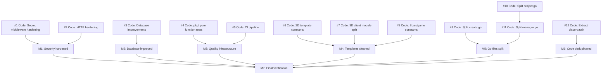

# Project Plan: Tech Debt Cleanup (v1)

## Scope

Systematically address the 17 tech debt items identified in the CRE-8 audit, organized into 12 child tickets across 4 waves. Covers security hardening, database improvements, test coverage, CI setup, Rust template cleanup, Go file splitting, and code deduplication. Each ticket is right-sized for a single swarm code workflow (1-5 files, clear scope).

## Ticket Decomposition

| # | Type | Title | Dependencies | Notes |
|---|------|-------|--------------|-------|
| 1 | code | Harden secret middlewares: fail-closed + constant-time compare | none | 3 files, lowest risk |
| 2 | code | Add HTTP hardening: body limits, security headers, admin-gate swarm actions, auth logging | none | server.go middleware setup |
| 3 | code | Database improvements: missing indexes, migration transaction safety, SQLite tuning, query limits | none | New migration + db.go + queries |
| 4 | code | Add pure function tests for all pkg/ packages | none | ~10 new test files, follows existing patterns |
| 5 | code | Add go test to check.sh and set up GitHub Actions CI | none | scripts/check.sh + .github/workflows/ |
| 6 | code | 2D template: extract constants.rs + deduplicate dialog rendering | none | Self-contained Rust changes |
| 7 | code | 3D client: split main.rs into modules + extract constants | none | Self-contained Rust changes |
| 8 | code | Boardgame template: extract constants.rs + remove dead code | none | Self-contained Rust changes |
| 9 | code | Split server/create.go into create_store.go, create_chat.go, create_hatch.go | none | Pure file moves, low risk |
| 10 | code | Split swarmorch/project.go into project_plan.go, project_decompose.go, project_verify.go | none | Pure file moves, medium risk |
| 11 | code | Split swarmorch/manager.go into sessions.go, gates.go, session_env.go + consolidate utils | 10 | Highest risk, needs project.go stable |
| 12 | code | Extract pkg/discordauth shared package from harness + site auth | none | New Go module + update both consumers |

## Dependency Graph

## Execution Order

### Wave 1 (parallel — security, DB, tests, CI, Rust cleanup)
- Ticket #1: Harden secret middlewares
- Ticket #2: HTTP hardening
- Ticket #3: Database improvements
- Ticket #4: Pure function tests for pkg/
- Ticket #5: CI pipeline
- Ticket #6: 2D template constants + dialog dedup
- Ticket #7: 3D client module split + constants
- Ticket #8: Boardgame constants + dead code

### Wave 2 (parallel — Go file splitting + dedup, after Wave 1)
- Ticket #9: Split server/create.go
- Ticket #10: Split swarmorch/project.go
- Ticket #12: Extract pkg/discordauth

### Wave 3 (after ticket #10)
- Ticket #11: Split swarmorch/manager.go

## Ticket Details

### Ticket #1: Harden secret middlewares: fail-closed + constant-time compare

**Scope**: Fix three security vulnerabilities in secret-based authentication.

**Changes**:
- `harness/internal/server/server.go`: Change `hookSecretMiddleware` to return 500 when `CM_HOOK_SECRET` is unset (currently fails open — passes all requests)
- `harness/internal/server/server.go`: Replace `!=` with `crypto/subtle.ConstantTimeCompare` in `hookSecretMiddleware`
- `harness/internal/server/president_api.go`: Replace `!=` with `crypto/subtle.ConstantTimeCompare` in `presidentAuthMiddleware`
- `harness/internal/server/mayor_api.go`: Replace `!=` with `crypto/subtle.ConstantTimeCompare` in `mayorAuthMiddleware`

**Verification**: `just check` passes. Manual test: unset `CM_HOOK_SECRET` and verify hook endpoints return 500 instead of 200.

### Ticket #2: HTTP hardening: body limits, security headers, admin-gate swarm, auth logging

**Scope**: Add HTTP-layer security protections.

**Changes**:
- `harness/internal/server/server.go`: Add `middleware.BodyLimit("10M")` to Echo setup
- `harness/internal/server/server.go`: Add security headers middleware (`X-Content-Type-Options: nosniff`, `X-Frame-Options: DENY`, `Strict-Transport-Security`)
- `harness/internal/server/server.go`: Move swarm dashboard gate routes (`/swarm/:id/approve`, `/swarm/:id/reject`, `/swarm/:id/cancel`) behind `AdminMiddleware`
- `harness/internal/server/server.go`, `president_api.go`, `mayor_api.go`: Log failed auth attempts with source IP

**Verification**: `just check` passes. Verify non-admin users can no longer approve/reject swarm gates via dashboard.

### Ticket #3: Database improvements: indexes, migration safety, SQLite tuning, query limits

**Scope**: Fix database performance and safety issues.

**Changes**:
- New migration file in `harness/internal/db/migrations/`: Add indexes for `worlds.mayor_secret`, `worlds.discord_channel_id`, `swarm_sessions.completed_at`, `swarm_tickets.parent_id`, `swarm_tickets.project_id`
- `harness/internal/db/db.go`: Register new migration in `migrationFiles` slice
- `harness/internal/db/db.go`: Wrap migration execution in transactions (`BEGIN` … `INSERT INTO _migrations` … `COMMIT`)
- `harness/internal/db/db.go`: Add `PRAGMA synchronous=NORMAL` (safe with WAL mode)
- `harness/internal/db/queries/mayor_messages.sql`: Add LIMIT parameter to `GetMayorMessages` query
- Regenerate sqlc if queries changed

**Verification**: `just check` passes. Verify migration applies cleanly on existing database.

### Ticket #4: Pure function tests for all pkg/ packages

**Scope**: Add test coverage for all pure (no-external-dependency) functions across the 4 pkg/ packages. Follow existing test conventions: table-driven, `t.Run`, `t.Parallel()`, raw `testing.T` assertions, no testify.

**New files** (~10):
- `pkg/worldchannel/sanitize_test.go` — `SanitizeChannelName` edge cases
- `pkg/worldchannel/uniqueness_test.go` — `FormatChannelTopic`, `ParseMayorName`
- `pkg/worldchannel/onboarding_test.go` — `extractJSON`, `splitConversation`
- `pkg/mayorchat/message_test.go` — `CountUserMessages`, `NthUserMessage`, `LastUserMessage`, `Truncate`
- `pkg/mayorchat/scripted_test.go` — `IsMayorNameRefusal`, `ScriptedStage`, `ScriptedResponseForStage`, `ScriptedExtractWorldInfo`
- `pkg/mayorchat/stream_test.go` — `ParseWorldReady`, `StripWorldReadyMarker`
- `pkg/mayorchat/prompt_test.go` — `BuildSystemPrompt`
- `pkg/mayorchat/cover_test.go` — `BuildCoverArtPrompt`, `MimeToExt`, `SavePendingCoverArt` (with `t.TempDir()`)
- `pkg/imagegen/client_test.go` — `DetectMIMEType`
- `pkg/markdown/renderer_test.go` — `MarkdownBytesToHTML` input/output tests

**Verification**: `go test ./...` passes in each pkg/ directory.

### Ticket #5: Add go test to check.sh and set up GitHub Actions CI

**Scope**: Strengthen the quality gate and add cloud CI.

**Changes**:
- `scripts/check.sh`: Add `go test ./...` for both harness and pkg/ directories after lint step
- `.github/workflows/check.yml`: New GitHub Actions workflow running format check, lint, and tests on push/PR

**Verification**: `just check` now runs tests. GitHub Actions workflow file is valid YAML.

### Ticket #6: 2D template: extract constants.rs + deduplicate dialog rendering

**Scope**: Extract ~60 magic numbers to named constants and eliminate copy-pasted dialog rendering code.

**Changes**:
- New file `templates/2d/src/constants.rs`: All named constants organized by domain (room geometry, camera, hotspot colors, dialog, Z-layers)
- `templates/2d/src/lib.rs`: Add `mod constants;`
- `templates/2d/src/camera.rs`: Replace magic numbers with constants
- `templates/2d/src/room.rs`: Replace magic numbers with constants
- `templates/2d/src/interaction.rs`: Replace magic numbers with constants; extract dialog rendering into a helper function
- `templates/2d/src/debug.rs`: Replace copy-pasted dialog rendering with shared helper; replace magic numbers with constants

**Key constants**: `ROOM_WIDTH`/`ROOM_HEIGHT`, `CAMERA_MAX_ZOOM_IN_SCALE`, `DRAG_THRESHOLD_PX`, `TAP_MAX_DURATION_SECS`, `HOTSPOT_DEFAULT_COLOR`, `DIALOG_BACKDROP_COLOR`, Z-layer constants (`Z_BACKGROUND` through `Z_DIALOG_TEXT`).

**Verification**: `cargo clippy --target wasm32-unknown-unknown` passes in `templates/2d/`. No behavioral changes.

### Ticket #7: 3D client: split main.rs into modules + extract constants

**Scope**: Split 623-line main.rs into 6 focused modules and extract ~30 magic numbers.

**New files**:
- `templates/3d/client/src/camera.rs` — `CameraState`, `CameraMode`, `GameCamera`, `toggle_camera_mode`, `game_camera` (~130 lines)
- `templates/3d/client/src/input.rs` — `cursor_lock_system`, `buffer_input`, `post_message_to_parent` (~80 lines)
- `templates/3d/client/src/scene.rs` — `setup_scene` (~60 lines)
- `templates/3d/client/src/player.rs` — mesh spawning, interpolation, movement systems (~100 lines)
- `templates/3d/client/src/connection.rs` — `get_server_port`, `get_client_id`, `connect_to_server` (~70 lines)
- `templates/3d/client/src/constants.rs` — All named constants

**Modified**: `templates/3d/client/src/main.rs` reduced to ~60 lines (App builder + mod declarations + system scheduling).

**Cross-module constraint**: Systems 6-9 are chained (cursor_lock → toggle_camera → game_camera → sync_player_meshes). Scheduling order must be preserved in main.rs.

**Verification**: `cargo clippy --target wasm32-unknown-unknown` passes in `templates/3d/client/`. No behavioral changes.

### Ticket #8: Boardgame template: extract constants.rs + remove dead code

**Scope**: Extract ~35 magic numbers (most importantly `BOARD_SIZE: u8 = 8` which appears 14 times) and clean up dead code.

**Changes**:
- New file `templates/boardgame/src/constants.rs`: `BOARD_SIZE`, `BOARD_SIZE_F32`, `BOARD_CENTER_OFFSET`, piece scales, UI sizes, Z-layers, colors
- `templates/boardgame/src/lib.rs`: Add `mod constants;`
- `templates/boardgame/src/rules.rs`: Replace all `8` literals with `BOARD_SIZE`
- `templates/boardgame/src/board.rs`: Replace magic numbers; convert `Square` and `Piece` to unit structs (fields are truly dead — never read)
- `templates/boardgame/src/interaction.rs`: Replace magic numbers with constants
- `templates/boardgame/src/ui.rs`: Replace magic numbers with constants
- `templates/boardgame/src/bridge.rs`: Remove `#[allow(dead_code)]` annotations; dead `BridgeAction` scaffolding can stay (it's the shared bridge pattern, just unwired)

**Verification**: `cargo clippy --target wasm32-unknown-unknown` passes in `templates/boardgame/`. Existing tests in `rules.rs` still pass.

### Ticket #9: Split server/create.go into focused files

**Scope**: Split 1046-line create.go into 3 files. Pure file moves — no behavioral changes.

**New files**:
- `harness/internal/server/create_store.go` — `InMemoryMessageStore` + methods (~40 lines). Zero coupling to `Server`.
- `harness/internal/server/create_chat.go` — `createChatSignals` struct + `handleCreatePage`, `handleCreateChat`, `handleCreateScriptedResponse`, `handleCreateScriptedPostRefusal`, `handleCreateScriptedForceCreate` (~530 lines)
- `harness/internal/server/create_hatch.go` — `prepareCreateCoverArtAndHatch`, `hatchCreateWorld`, `saveCoverArtToWorld`, `createDiscordChannelForWorld`, `handleCreateCoverPreview`, `handleCreateGenerateCover`, `handleCreateHatch` (~450 lines)

**Modified**: `harness/internal/server/create.go` deleted (all content moved to 3 new files).

**Verification**: `just check` passes. All existing tests still pass.

### Ticket #10: Split swarmorch/project.go into focused files

**Scope**: Split 851-line project.go into 3 focused files plus a parsers file. Pure file moves.

**New files**:
- `harness/internal/swarmorch/project_plan.go` — Plan creation & reconciliation: `CreateProjectTicketsFromPlan`, `readProjectPlan`, `ParseProjectPlan`, `createDependencyEdges`, `createMilestones`, `ReconcileProjectTickets` (~250 lines)
- `harness/internal/swarmorch/project_decompose.go` — Research decomposition: `SpawnProjectResearchChildren`, `ParseDecomposeOutput`, `advanceProjectDecompose`, `aggregateResearchFindings`, `hasResearchChildren`, `buildProjectGraph`, `completedChildTickets` (~415 lines)
- `harness/internal/swarmorch/project_verify.go` — Verification & wave scheduling: `SpawnProjectWorkflows`, `advanceProjectVerify`, `CheckProjectProgress`, `advanceProject`, `startProjectOrchestrator` (~195 lines)

**Modified**: `harness/internal/swarmorch/project.go` reduced to pure parsers (~70 lines) or removed if parsers move to respective files.

**Also**: Move `nowUTC` to `util.go` (or to the file that uses it most).

**Verification**: `just check` passes. All existing `project_test.go` tests still pass.

### Ticket #11: Split swarmorch/manager.go into focused files

**Scope**: Split 1981-line manager.go into 4 files plus utility consolidation. Highest-risk split — `advanceWorkflow` (278 lines) is the most entangled method.

**Depends on**: Ticket #10 (project.go split must be stable, since manager.go methods call into project.go methods).

**New files**:
- `harness/internal/swarmorch/sessions.go` — Session management: `spawnSession`, `watchSession`, `handleSessionComplete`, `captureTokens`, `createTmuxSession`, `sendSkillPrompt` + helpers (`isTmuxSessionAlive`, `TokenFilePath`, `ResultFilePath`, `LearningFilePath`, `SessionName`, `ListActiveSessions`) + JSONL logging (`closeJSONLWriter`, `WriteJSONLEvent`) + hook signals (`SignalStart`, `SignalCompletion`, `IncrementContextPressure`, `GetContextPressure`) (~390 lines)
- `harness/internal/swarmorch/gates.go` — Human review gates: `enterGate`, `requireAwaitingReview`, `ApproveGate`, `RejectGate`, `advanceFromGate` (~340 lines). **NOTE**: `ApproveGate` and `RejectGate` acquire `m.mu` — document lock discipline with `// NOTE: acquires m.mu` comments.
- `harness/internal/swarmorch/session_env.go` — Environment building: `buildEnv`, `populatePreviousContext`, `populateStackContext`, `resolveTicketDescription` (~200 lines). Rename from existing `env.go` if needed.
- `harness/internal/swarmorch/util.go` — Consolidate orphaned utilities: `toNullString` (from learnings.go), `nowUTC` (from project.go)

**Also**: Move `captureLearnings` to existing `learnings.go`.

**Modified**: `harness/internal/swarmorch/manager.go` reduced to ~600 lines (Manager struct, `StartWorkflow`, `CancelWorkflow`, `RecoverWorkflows`, `advanceWorkflow`, `completeWorkflow`, `GetWorkflow`, `emitEvent`, `linearComment`, `linearUpdateStatus`, config setters).

**Verification**: `just check` passes. All existing `manager_test.go` tests still pass. Verify `advanceWorkflow` still correctly calls methods across new files.

### Ticket #12: Extract pkg/discordauth shared package

**Scope**: Extract ~200 lines of duplicated Discord OAuth code into a new shared Go module.

**New files**:
- `pkg/discordauth/go.mod` — New Go module
- `pkg/discordauth/client.go` — `ExchangeCode()`, `FetchUser()`, `AvatarURL()`
- `pkg/discordauth/crypto.go` — `RandomHex()`, `DevDiscordID()`
- `pkg/discordauth/oauth.go` — `AuthorizeURL()`, `Config` struct, OAuth constants
- `pkg/discordauth/cookie.go` — `SetStateCookie()`, `ValidateStateCookie()`, `SetSessionCookie()`, `ClearSessionCookie()`
- `pkg/discordauth/types.go` — `DiscordUser`, `TokenResponse`

**Modified**:
- `harness/internal/auth/auth.go`: Replace duplicated functions with calls to `pkg/discordauth`
- `site/internal/auth/auth.go`: Replace duplicated functions with calls to `pkg/discordauth`
- `harness/go.mod`: Add `replace` directive for `pkg/discordauth`
- `site/go.mod`: Add `replace` directive for `pkg/discordauth`

**Not extracted** (intentionally divergent): `HandleCallback()` (different storage models), `SessionMiddleware()` (different auth models), secure cookie logic (different detection methods).

**Verification**: `just check` passes. Both harness and site compile and auth flows work.

## Milestones

- [ ] M1: Security hardened — Hook secret fails closed, constant-time comparison on all secret checks, body limits active, security headers set, swarm dashboard gated to admins (tickets #1, #2)
- [ ] M2: Database improved — Missing indexes added, migrations transaction-safe, `synchronous=NORMAL` set, unbounded query fixed (ticket #3)
- [ ] M3: Quality infrastructure — Pure function tests for all pkg/ packages pass, `just check` runs tests, GitHub Actions CI configured (tickets #4, #5)
- [ ] M4: Rust templates cleaned — All magic numbers extracted to named constants, 2D dialog dedup done, 3D main.rs split into 6 modules, boardgame dead code removed (tickets #6, #7, #8)
- [ ] M5: Go files split — server/create.go (3 files), swarmorch/project.go (3 files), swarmorch/manager.go (4 files) all split with zero behavioral changes (tickets #9, #10, #11)
- [ ] M6: Code deduplicated — `pkg/discordauth` extracted, both harness and site using shared auth package (ticket #12)
- [ ] M7: Final verification — `just check` passes with all changes integrated, all existing tests pass

## Graphite Stack Plan

Branch stack order (bottom to top):
1. `swarm/CRE-8/secret-middleware-hardening` (ticket #1)
2. `swarm/CRE-8/http-hardening` (ticket #2)
3. `swarm/CRE-8/database-improvements` (ticket #3)
4. `swarm/CRE-8/pkg-pure-function-tests` (ticket #4)
5. `swarm/CRE-8/ci-pipeline` (ticket #5)
6. `swarm/CRE-8/2d-template-constants` (ticket #6)
7. `swarm/CRE-8/3d-client-module-split` (ticket #7)
8. `swarm/CRE-8/boardgame-constants` (ticket #8)
9. `swarm/CRE-8/split-create-go` (ticket #9)
10. `swarm/CRE-8/split-project-go` (ticket #10)
11. `swarm/CRE-8/split-manager-go` (ticket #11, stacked on #10)
12. `swarm/CRE-8/extract-discordauth` (ticket #12)

## Risks

- **manager.go split is highest risk**: The `advanceWorkflow` method (278 lines) calls into groups across all new files. It must stay in manager.go and the `m.mu` lock discipline must be documented at every acquisition point.
- **Bevy const Color**: `Color::srgba()` may not be usable in `const` contexts in Bevy 0.15. Templates may need `lazy_static` or `const fn` wrappers for color constants.
- **Git blame disruption**: All file splits lose per-line blame history. Use `git log --follow` after splits.
- **Concurrent WASM builds**: The VPS has 10 GB RAM and each WASM build uses ~5 GB. Tickets #6, #7, #8 (Rust templates) should NOT run `cargo build` simultaneously — `cargo clippy` is sufficient for verification.
- **pkg/discordauth extraction risk**: Both harness and site auth flows are production-critical. The shared package extraction must not change any user-visible behavior. Test by verifying OAuth login still works on both servers.
- **Wave 2/3 merge conflicts**: Go file splits (tickets #9-#11) will conflict with any concurrent changes to the same files. These should run after Wave 1 stabilizes.

## Items Deferred (Out of Scope)

These items from the research were deprioritized:
- **Extract shared Bevy BridgePlugin crate**: Viable but requires build pipeline changes for world-fork copying. Deferred to a future ticket.
- **Extract pkg/dsutil for Datastar expressions**: SignalManager divergence (flat vs namespaced) makes unification complex. Deferred.
- **Extract shared Claude chat streaming handler**: Tightly coupled to template rendering. Deferred.
- **Docker hardening**: Dev-only concern. Deferred.
- **Mock-based tests for ConversationManager**: Depends on interface extraction. Deferred to follow-up ticket after pure function tests land.
- **CSRF middleware**: Mitigated by SameSite=Lax cookies and internal-only access model. Deferred.
- **Session cache**: Not needed at current scale.
